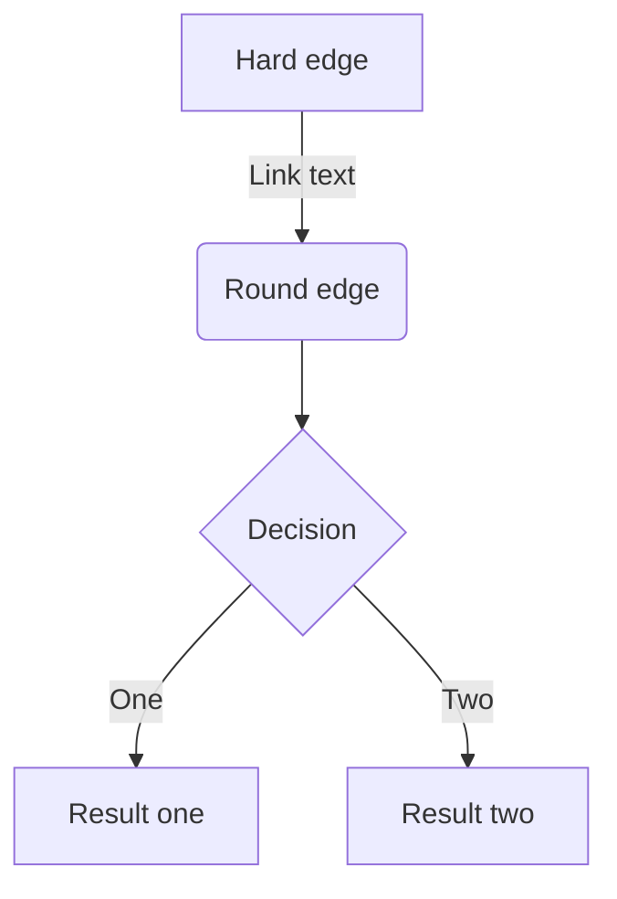

## 测试1

测试1

```
graph TD
    Start --> Stop
```

测试2

graph TD
    Start --> Stop

测试3


```mermaid
graph TD
A[Hard edge] -->|Link text| B(Round edge)
B --> C{Decision}
C -->|One| D[Result one]
C -->|Two| E[Result two]
```

测试4


graph TD;
    A-->B;
    A-->C;
    B-->D;
    C-->D;

