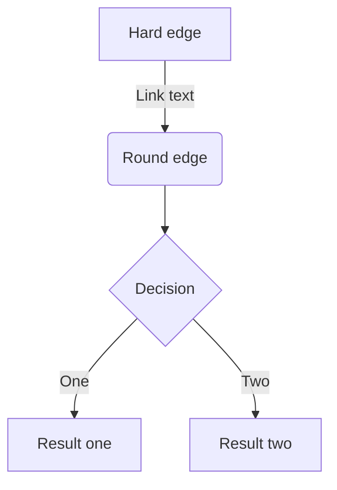

测试1

```
graph TD

A[Start] --> B[Your Operation]
B --> C{Yes or No?}
C --> |yes| D[end]
C --> |no| B

```

测试2

~~~mermaid
graph TD        //TD从上到下
A[add]-->B        //矩形框从A向下指向B。A变量名称，[]显示形状add显示名字
C-->S            //矩形框从C到S
d-->k()
r-->|备注|q（）    //备注在连接线之间进行备注
~~~

测试3


